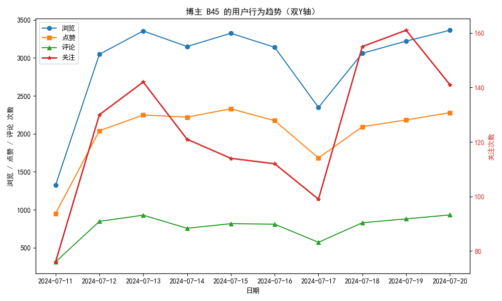
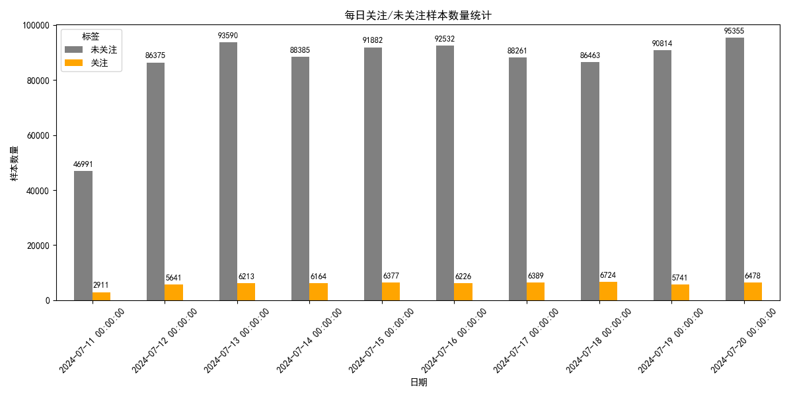
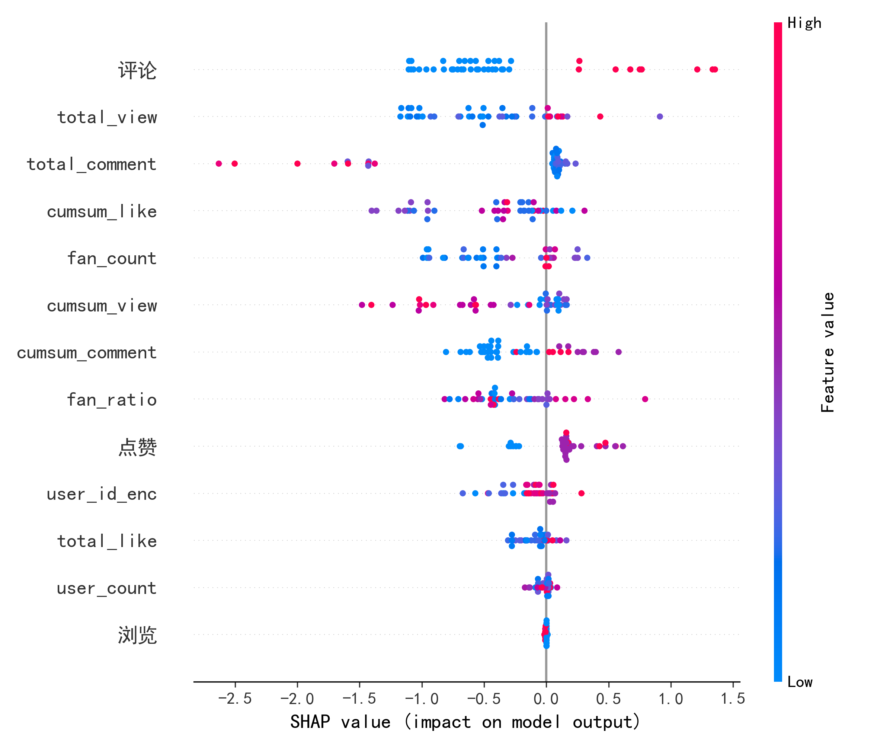

# 问题一

问题一要求基于用户与博主之间的历史交互数据（观看，点赞，评论，关注）进行统计分析，能够有效揭示用户的行为特征，为内容优化和交互提升提供策略，根据附件一提供的数据，建立数学模型，预测各博主在`2024.7.21`当天的新增关注数，并根据预测结果，在表一中填写当日新增关注数最多的5位博主ID及新增关注数。

## 先进行数据分析

查看每位博主的观看，点赞，评论，关注数据，发现每一互动趋势中当日`新增关注`与当日`浏览`，`点赞`，`评论`密切相关。



## 解决思路

将问题分为两个阶段，

* 阶段一，通过前`T`日的`浏览`，`点赞`，`评论`数据中预测`T+1`日互动数据，

* 阶段二，针对每位博主的当日互动情况学习每日`互动`---->`关注`转化率。

### 阶段一

取`time_step = 5`每个样本序列长度为5，输入维度：三个行为特征（浏览，点赞，评论）

将前10日数据按0.8:0.2的比例划分训练集和测试集

```python
class LSTMRegressor(nn.Module):
    def __init__(self, input_size=4, hidden_size=64, num_layers=1):
        super().__init__()
        self.lstm = nn.LSTM(input_size, hidden_size, num_layers, batch_first=True)
        self.fc = nn.Linear(hidden_size, 1)

    def forward(self, x):
        out, _ = self.lstm(x)
        out = out[:, -1, :]
        out = self.fc(out)
        return out.squeeze(1)
```


#### LSTM模型评价

| 互动行为 | RMSE   | MAE    | R<sup>2</sup> |
| -------- | ------ | ------ | ------------- |
| 浏览     | 0.0518 | 0.0338 | 0.9385        |
| 评论     | 0.0404 | 0.280  | 0.9376        |
| 点赞     | 0.0707 | 0.0424 | 0.8971        |


### 阶段二

采用极端梯度提升回归GB（`GradientBoostRegression`）

对前10日的数据进行预测，模型如下

```python

model = GradientBoostingRegressor(n_estimators=100, max_depth=5, learning_rate=0.1)
model.fit(X_train, y_train)
```


#### 模型评价

R<sup>2</sup> = 0.9182

MAE = 23.71

RMSE = 34.47

#### 结果

预测结果如下

| Blogger ID | 关注 |
| ---------- | ---- |
| B21        | 503  |
| B5         | 496  |
| B15        | 387  |
| B60        | 344  |
| B13        | 289  |

# 问题二

根据当日互动情况预测5位用户的关注情况，实际关注数，及关注的博主
## 目前采用的方法：

对提供的attachment文件进行每日互动情况统计，结构为

|User ID|Blogger ID|Date|浏览|点赞|评论|label|
|:--:|:--:|:--:|:--:|:--:|:--:|:--:|
|U1|B10|2024-07-22|1|1|0|0|
|U1|B15|2024-07-22|1|1|0|0|
|U1|B17|2024-07-22|1|1|0|0|

历史数据和0722当日的数据分别进行存储`data\0722_activity_used_to_train.csv`和`data\day_activity_used_to_train.csv`

### 为避免训练时数据泄露
为避免训练时数据泄露，将原本`groupby`时对应的关注去除，新增`label`列用作模型训练的target

### 模型训练时
模型训练时对应的`user_id`,`blogger_id`作为文本类无法传入模型，
将训练集和测试集合并后统一`encode`然后新增`user_id_enc`,`blogger_id_enc`列作为训练的特征。

### 采用`lightGBM`,`XGBoost`模型进行预测

由于样本分布不均匀，其中百万条均是未关注数据，导致传统分类模型直接全部预测为`0`,
加入`scale_pos_weight=scale_pos_weight`训练分布不均匀目标
结果如下

### 训练集评估报告：
所采用的模型
`XGBoost`

```python
model = xgb.XGBClassifier(
    objective='binary:logistic',
    n_estimators=500,
    max_depth=8,
    learning_rate=0.01,
    scale_pos_weight=scale_pos_weight,  # 处理类别不平衡
    eval_metric='logloss',
    random_state=42
)
```

||precision|recall|f1-score|support|
|:--|:--:|:--:|:--:|:--:|
|0|0.9793|0.6957|0.8135|860648|
|1|0.1499|0.7848|0.2518|58864|
|accuracy|||0.7014|919512|
|macro avg|0.5646|0.7402|0.5326|919512|
|weighted avg|0.9262|0.7014|0.7775|919512|

## 选择能够处理非均匀分布的概率问题
查看数据分布



### 选择上采样后效果仍没有提升，调整思路

### 选择仅针对目标用户进行预测

筛选目标用户行为数据`U7`,`U6749`,`U5769`,`U14990`,`U52010`大大减少无效样本数量
通过用户-博主两侧进行建模

针对目标用户获取历史互动数据，获取用户已关注博主列表，获取用户在0722当日行为数据，找出未关注但有大量互动博主

在博主侧，对潜在博主进行特征建模，获取博主和其他用户的互动情况及关注转化比

然后进行预测看看效果

#### 用户已关注列表

|User ID|Blogger IDs|
|--|--|
|U14990|['B13']|
|U52010|['B2' 'B23' 'B3' 'B72']|
|U5769|['B13' 'B19' 'B22' 'B9']|
|U6749|['B44']|
|U7|['B12' 'B13' 'B2' 'B4' 'B6' 'B8']|

修改方法后，能够准确预测

#### 目前历史数据采用的特征


#### 训练集评估报告

=== 训练集评估报告 ===
||precision|    recall|  f1-score|   support|
|--|--|--|--|--|
|0|     1.0000|    0.9816|    0.9907|       217|
|1     |0.8000|    1.0000|    0.8889|        16|
| accuracy||| 0.9828|233|
|macro avg |    0.9000|    0.9908|    0.9398|       233|
|weighted avg    | 0.9863|    0.9828|    0.9837|       233|

效果不错ROC和PR曲线均达到了1


#### 预测结果如下

|User ID|new_followed_bloggers|
|--|--|
|U52010|B13|
|U6749|"B13,B24"|
|U7|B23|

#### 模型解释性分析



# 问题三

用户与博主之间的互动数为点赞数，评论数，关注数之和，平台制定合理的推荐方案，为用户推送内容，增加用户与博主之间的互动。基于附件1的数据，建立数学模型，预测指定用户在`2024.07.21`是否在线。若在线, 预测该用户可能与博主产生的互动关系，并给出可能与其产生互动最高的三名博主。本题需要预测的用户编号为`U9`, `U22405`, `U16`, `U48420`

| 用户ID  | U9   | U22405 | U16  | U48420 |
| :-------: |------ | :----: | :--: | :----: |
| 博主ID1 |      |        |      |        |
|博主ID2|||||
|博主ID3|||||

## 解决思路

用户在使用社交平台往往会有周期性规律，比如在周末上线的可能要比工作日高，基于此，

# 问题四

平台在制定推荐方案时， 会充分考虑不同用户使用社交媒体的时间习惯，在问题三的基础上，基于附件一的数据，建立数学模型，预测表四种指定用户在`2024.07.23`是否在线，进一步预测该用户在每个在线时段与每个博主的互动数，给出该互动数最高的三位博主ID及对应的时段，并将结果写入表内

| 用户ID  | U10  | U1951 | U1833 | U26447 |
| :-----: | :--: | :---: | :---: | :----: |
| 博主ID1 |      |       |       |        |
|  时段1  |      |       |       |        |
| 博主ID2 |      |       |       |        |
|  时段2  |      |       |       |        |
| 博主ID3 |      |       |       |        |
|  时段3  |      |       |       |        |

